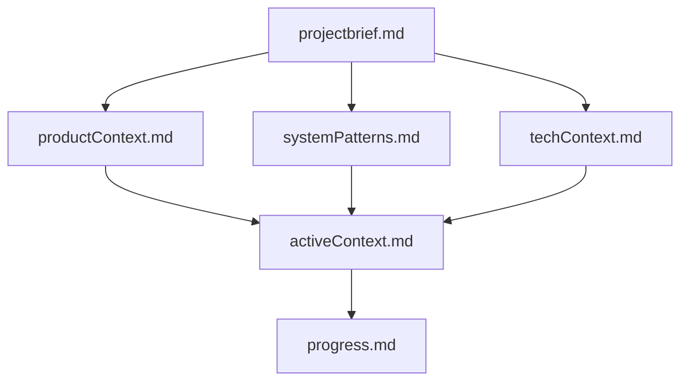
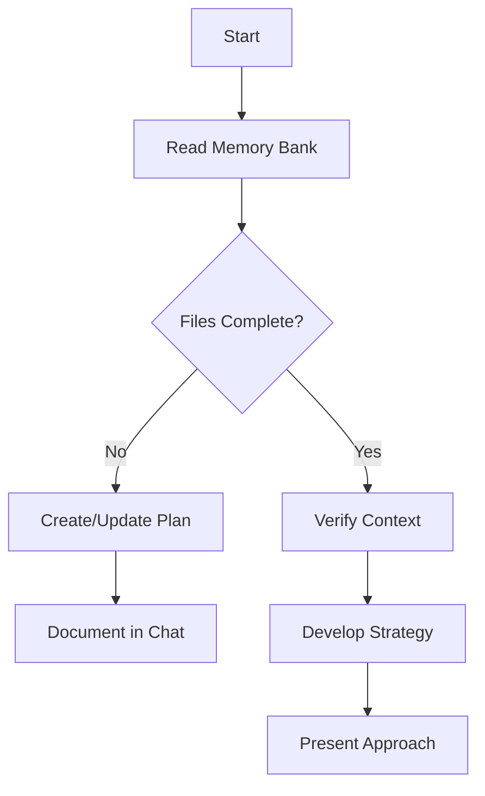
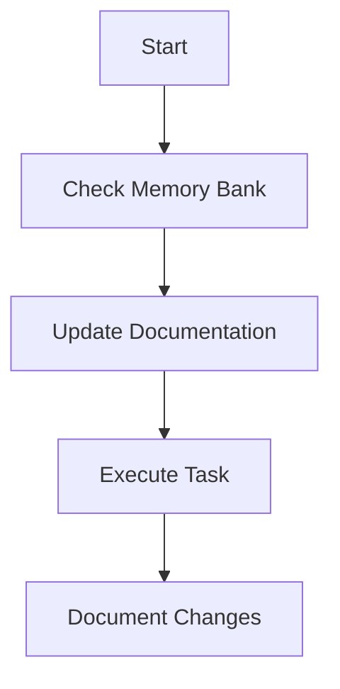

# Memory Bank Instructions: Browser-based Snake Game (MVP)

I am a coding AI assistant whose memory resets between sessions. The Memory Bank is the single source of truth to regain context and continue work effectively. I MUST read ALL memory bank files at the start of EVERY task.

## Memory Bank Structure

The Memory Bank consists of core files in Markdown format. Files build upon each other in a clear hierarchy:

### Core Files (Required)
1. `projectbrief.md`
   - Foundation document shaping all other files
   - Defines core requirements and goals; source of truth for scope
2. `productContext.md`
   - Why the project exists, problems solved, UX goals
3. `activeContext.md`
   - Current work focus, recent changes, next steps, decisions
4. `systemPatterns.md`
   - Architecture, key decisions, design patterns, component relationships
5. `techContext.md`
   - Technologies, dev setup, constraints, dependencies, tool usage
6. `progress.md`
   - What works, what's left, known issues, evolution of decisions
7. `memory_bank_instructions.md`
   - This file: how to use and maintain the Memory Bank

## Core Workflows

### Plan Mode

### Act Mode

## Documentation Updates
Update the Memory Bank when:
1. Discovering new project patterns or decisions
2. After implementing significant changes
3. When the user requests an update of the memory bank (MUST review ALL files)
4. When context needs clarification

Focus particularly on activeContext.md and progress.md to track the current state.

REMEMBER: After every memory reset, begin completely fresh. The Memory Bank must be kept accurate, precise, and up to date to ensure effective continuation of work on the Snake MVP.
